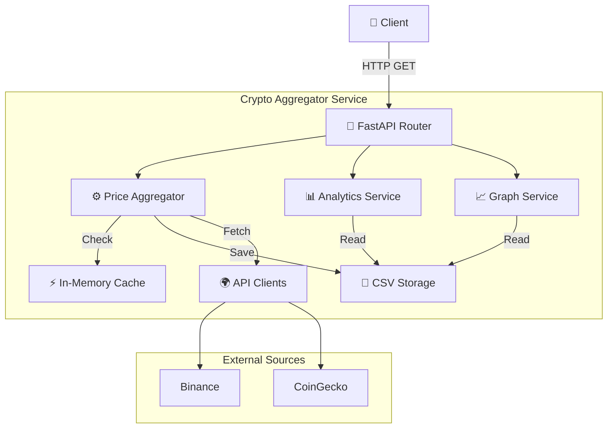

# 📈 Crypto Aggregator & Analytics

Асинхронный микросервис на **FastAPI** для агрегации цен криптовалют с внешних бирж, их анализа и визуализации. 
Проект реализует принципы **Clean Architecture** и паттерны проектирования.

## 🚀 Возможности

*   **Мульти-сорсинг:** Параллельный сбор цен с **Binance** и **CoinGecko**.
*   **Аналитика:** Расчет min/max/avg, спреда и поиск аномалий (выбросов).
*   **Визуализация:** Генерация графиков цен (PNG) с фильтрацией по периодам (`1h`, `24h`, `7d`).
*   **Кэширование:** In-Memory Cache для снижения нагрузки на внешние API.
*   **Хранение:** История сохраняется в CSV.

## 🛠 Стек технологий
*   **Язык:** Python 3.1+
*   **Web:** FastAPI, Uvicorn
*   **Аналитика:** Pandas
*   **Графики:** Matplotlib
*   **Контейнеризация:** Docker

## 🏗 Архитектура


```mermaid
graph TD
    Client[👤 Client] -->|HTTP GET| API[🔌 FastAPI Router]
    
    subgraph "Crypto Aggregator Service"
        API --> Aggregator[⚙️ Price Aggregator]
        API --> Analytics[📊 Analytics Service]
        API --> Visualizer[📈 Graph Service]
        
        Aggregator -->|Check| Cache[⚡ In-Memory Cache]
        Aggregator -->|Save| Storage[💾 CSV Storage]
        Aggregator -->|Fetch| Clients[🌍 API Clients]
        
        Analytics -->|Read| Storage
        Visualizer -->|Read| Storage
    end
    
    subgraph "External Sources"
        Clients --> Binance
        Clients --> CoinGecko
    end
```


## 🚀 Как запустить проект:

1.  **Скачайте проект:**
    Откройте терминал и введите:
    ```
    git clone https://github.com/Keyloner/crypto-aggregator.git
    cd crypto-aggregator
    ```

2.  **Соберите приложение:**
    ```
    docker build -t crypto-app .
    ```

3.  **Запустите:**
    ```
    docker run -p 8000:8000 crypto-app
    ```

4.  **Готово!** Откройте в браузере: [http://127.0.0.1:8000/docs](http://127.0.0.1:8000/docs)